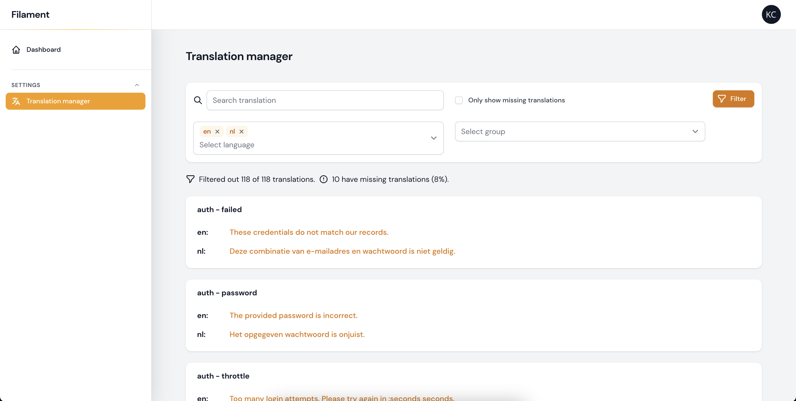

# Laravel Filament Chained Translation Manager

[](https://packagist.org/packages/statikbe/laravel-filament-chained-translation-manager)
[](https://github.com/statikbe/laravel-filament-chained-translation-manager/actions?query=workflow%3A"Fix+PHP+code+style+issues"+branch%3Amain)
[](https://packagist.org/packages/statikbe/laravel-filament-chained-translation-manager)

The Laravel Filament Chained Translation Manager allows you to easily edit the translations of your current Laravel environment. 
This translation manager uses the [Laravel Chained Translator](https://github.com/statikbe/laravel-chained-translator),
that enables you to override the default translations with translations for a specific environment, e.g. 
a content manager can independently edit and override the translation files on the production environment from the translations provided by the developers.

Typically at some point during the development phase, a content manager wants to translate or finetune the translation 
strings added by developers. This often results in merge and versioning issues, when developers and content managers are 
working on the translation files at the same time.

The Chained Translator package allows translations created by developers to exist separately from translations edited 
by the content manager in separate lang directories. The library merges the translations of both language directories, 
where the translations of the content manager (the custom translations) override those of the developer (the default translations). 
Check the documentation of the [Laravel Chained Translator](https://github.com/statikbe/laravel-chained-translator) for more info.

There is also a [Laravel Nova version](https://github.com/statikbe/laravel-nova-chained-translation-manager) of this package.

## Features

- Save translations of the current environment to separate translation files in a separate language directory to avoid version conflicts.
- Immediately save translations
- Search for translations and translation keys
- Filter translations for specific groups and languages
- Only show keys with missing translations
- Shows statistics of how many fields are completely translated

This tool does not provide features to add new translation keys, because our target users are translators and 
content managers and we want to avoid that they add unnecessary translation keys.




## Installation

You can install the package via composer:

```bash
composer require statikbe/laravel-filament-chained-translation-manager
```

You can publish the config file with:

```bash
php artisan vendor:publish --tag="filament-translation-manager-config"
```

This is the contents of the published config file:

```php
return [
    'enabled' => true,

    /*
    |--------------------------------------------------------------------------
    | Application Supported Locale Configuration
    |--------------------------------------------------------------------------
    |
    | The application locale determines the possible locales that can be used.
    | You are free to fill this array with any of the locales which will be
    | supported by the application.
    |
    */
    'supported_locales' => [
        'en',
        'nl',
        'fr',
    ],

    /*
    |--------------------------------------------------------------------------
    | Access
    |--------------------------------------------------------------------------
    |
    | Limited = false (default)
    |   Anyone can use the translation manager.
    |
    | Limited = true
    |   The page will use the provided gate to see if the user has access.
    |   - Default Laravel: you can define the gate in a service provider
            (https://laravel.com/docs/9.x/authorization)
    |   - Spatie permissions: set the 'gate' variable to a permission name you want to check against, see the example below.
    |
    |
    */
    'access' => [
        'limited' => false,
        //'gate' => 'view-filament-translation-manager',
    ],

    /*
     |--------------------------------------------------------------------------
     | Ignore Groups
     |--------------------------------------------------------------------------
     |
     | You can list the translation groups that you do not want users to translate.
     | Note: the JSON files are grouped in 'json-file' by default. (see config/laravel-chained-translator.php)
     */
    'ignore_groups' => [
//        'auth',
    ],
    
    /*
     |--------------------------------------------------------------------------
     | Navigation Sort
     |--------------------------------------------------------------------------
     |
     | You can specify the order in which navigation items are listed.
     | Accepts integer value according to filamnet documentation.
     | (visit: https://filamentphp.com/docs/2.x/admin/resources/getting-started#sorting-navigation-items)
     */
    'navigation_sort' => null,
];

```

Optionally, you can publish the views using

```bash
php artisan vendor:publish --tag="filament-translation-manager-views"
```

Optionally, you can also publish the translations

```bash
php artisan vendor:publish --tag="filament-translation-manager-translations"
```

## Configuration

You can configure the custom language directory name and extend or finetune the service provider of the 
[Laravel Chained Translator](https://github.com/statikbe/laravel-chained-translator). Have a look at the configuration 
options of the [Laravel Chained Translator library](https://github.com/statikbe/laravel-chained-translator).

### Supported locales

There are two ways to change the supported locales.

#### Option 1

Publish the config file with the command below and configure it with your supported locales and editor preferences (see above).
Then configure the `supported_locales` variable:

```php
/*
|--------------------------------------------------------------------------
| Application Supported Locale Configuration
|--------------------------------------------------------------------------
|
| The application locale determines the possible locales that can be used.
| You are free to fill this array with any of the locales which will be 
| supported by the application.
|
*/
'supported_locales' => [
    'en',
    'nl',
    'fr'
],
```

#### Option 2

If your application already has a config that declares your locales than you are able to set the supported locales 
in any service provider. 
Create a new one or use the `app/Providers/AppServiceProvider.php` and set the supported locales as an array in the boot function as follows:

```php
use Statikbe\FilamentTranslationManager\FilamentTranslationManager;

public function boot()
{
    FilamentTranslationManager::setLocales(['en', 'nl']);
}
```

### Access

You can limit the access to the Translation Manager, by configuring the `access` variable. 
If you set the `limited` key to `true`, you can set a Laravel Gate class or a permission name of the [Spatie Permissions package](https://github.com/spatie/laravel-permission).

```php 
/*
|--------------------------------------------------------------------------
| Access
|--------------------------------------------------------------------------
|
| Limited = false (default)
|   Anyone can use the translation manager.
|
| Limited = true
|   The page will use the provided gate to see if the user has access.
|   - Default Laravel: you can define the gate in a service provider (https://laravel.com/docs/9.x/authorization)
|   - Spatie permissions: set the 'gate' variable to a permission name you want to check against, see the example below.
|
|
*/
'access' => [
    'limited' => false,
    //'gate' => 'view-filament-translation-manager',
],
```

### Ignoring groups

You may also ignore certain groups of translations to be shown in the Nova UI. Create an array with keys that you want to ignore:

```php 
/*
 |--------------------------------------------------------------------------
 | Ignore Groups
 |--------------------------------------------------------------------------
 |
 | You can list the translation groups that you do not want users to translate.
 | Note: the JSON files are grouped in 'json-file' by default. (see config/laravel-chained-translator.php)
 */
'ignore_groups' => [
    'auth',
],
```

## Usage

The library creates a new directory for the new translations, see [Laravel Chained Translator](https://github.com/statikbe/laravel-chained-translator).
Check the configuration options of the [Laravel Chained Translator](https://github.com/statikbe/laravel-chained-translator) package to change this.

The Translation Manager is automatically added to the Filament menu.

### Merging translations

You can combine the custom translations of the current environment with the default translation files, 
by running the command provided by the [Laravel Chained Translator library](https://github.com/statikbe/laravel-chained-translator).

## Changelog

Please see [CHANGELOG](CHANGELOG.md) for more information on what has changed recently.

## Contributing

Please, submit bugs or feature requests via the [Github issues](https://github.com/statikbe/laravel-filament-chained-translation-manager/issues).
Pull requests are welcomed! Thanks!

## Security Vulnerabilities

Please review [our security policy](../../security/policy) on how to report security vulnerabilities.

## Credits

- [Kobe Christiaensen](https://github.com/Kobo-one)
- [Sten Govaerts](https://github.com/sten)
- [All Contributors](../../contributors)

## License

The MIT License (MIT). Please see [License File](LICENSE.md) for more information.
