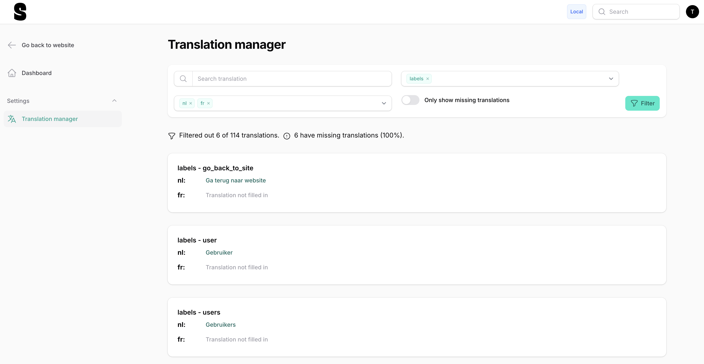

# Laravel Filament Chained Translation Manager


The Laravel Filament Chained Translation Manager allows you to easily edit the translations of your current Laravel environment.
This translation manager uses the [Laravel Chained Translator](https://github.com/statikbe/laravel-chained-translator),
that enables you to override the default translations with translations for a specific environment, e.g.
a content manager can independently edit and override the translation files on the production environment from the translations provided by the developers.

Typically, at some point during the development phase, a content manager wants to translate or finetune the translation
strings added by developers. This often results in merge and versioning issues, when developers and content managers are
working on the translation files at the same time.

The Chained Translator package allows translations created by developers to exist separately from translations edited
by the content manager in separate lang directories. The library merges the translations of both language directories,
where the translations of the content manager (the custom translations) override those of the developer (the default translations).
Check the documentation of the [Laravel Chained Translator](https://github.com/statikbe/laravel-chained-translator) for more info.

There is also a [Laravel Nova Chained Translation Manager](https://github.com/statikbe/laravel-nova-chained-translation-manager) of this package.

## Features

-   Save translations of the current environment to separate translation files in a separate language directory to avoid version conflicts.
-   Immediately save translations.
-   Search for translations and translation keys.
-   Filter translations for specific groups and languages.
-   Only show keys with missing translations.
-   Shows statistics of how many fields are completely translated.
-   :sparkles: Multi-line translation strings support: toggle between text input and text area.

This tool does not provide features to add new translation keys, because our target users are translators and
content managers, and we want to avoid that they add unnecessary translation keys.

## Installation

> **Note**
> For **Filament v3.x** use **[v3.x](https://github.com/statikbe/laravel-filament-chained-translation-manager/releases)** version.
> For **Filament v2.x** use **[v1.x](https://github.com/statikbe/laravel-filament-chained-translation-manager/releases)** version.

1. You can install the package via Composer:

```bash
composer require statikbe/laravel-filament-chained-translation-manager
```

2. Register the plugin for the Filament Panels you want:

```php 
public function panel(Panel $panel): Panel
{
    return $panel
        ->plugins([
            \Statikbe\FilamentTranslationManager\FilamentChainedTranslationManagerPlugin::make(),
        ]);
}
```

2. Be sure to add the following line to your theme.css of your Filament panel.
```
@source '../../../../vendor/statikbe/laravel-filament-chained-translation-manager/resources/**/*.blade.php';
```

3. Now run the following command to compile the plugin styles into Filament's stylesheet:

```bash
npm run build
```

4. Publish the `config` file then setup your configuration:

```bash
php artisan vendor:publish --tag="filament-translation-manager-config"
```

## Configuration

You can configure the custom language directory name and extend or finetune the service provider of the
[Laravel Chained Translator](https://github.com/statikbe/laravel-chained-translator). Have a look at the configuration
options of the [Laravel Chained Translator library](https://github.com/statikbe/laravel-chained-translator).

### Supported locales

There are two ways to change the supported locales.

#### Option 1

Set up the supported locales using the configuration. By default, it will fallback to the locale and fallback locale. However, you can customize the configuration to include additional locales as follows:

```php
'locales' => [
    'en',
    'fr',
],
```

#### Option 2

If your application already has a config that declares your locales than you are able to set the supported locales in any service provider.
Create a new one or use the `app/Providers/AppServiceProvider.php` and set the supported locales as an array in the boot function as follows:

```php
use Statikbe\FilamentTranslationManager\FilamentTranslationManager;

public function boot()
{
    FilamentTranslationManager::setLocales(['en', 'nl']);
}
```

### Gate

You can restrict access to the Translation Manager by configuring the Gate variable.

```php
'gate' => 'view-filament-translation-manager',
```

### Ignoring groups

You can choose to exclude specific groups of translations from appearing in Filament. Create an array with the keys that you wish to ignore:

```php
'ignore_groups' => [
    'auth',
],
```

### Navigation Group

You can set the navigation group in different ways. Either edit the translation files, or change the translation key in 
the config `navigation_group`.

### Navigation sort

You can tweak the position in the navigation group by configuring this setting:

```php
'navigation_sort' => 11,
```

### Navigation Icon

You can customize the navigation icon by configuring the `navigation-icon` variable
```
'navigation_icon' => 'heroicon-o-language',
```

Alternatively, you can use an icon enum, like `HeroIcon`.
Or you can replace the icon with your own custom icon set, by registering a different icon for this icon:
`filament-chained-translation-manager::nav-icon`.

## Usage

The library creates a new directory for the new translations, see [Laravel Chained Translator](https://github.com/statikbe/laravel-chained-translator).
Check the configuration options of the [Laravel Chained Translator](https://github.com/statikbe/laravel-chained-translator) package to change this.

Additionally, please note that the Translation Manager is automatically included in the Filament menu.

### Merging translations

You can combine the custom translations of the current environment with the default translation files,
by running the command provided by the [Laravel Chained Translator](https://github.com/statikbe/laravel-chained-translator).

## Screenshots



## Upgrading

Please see [UPGRADING](UPGRADING.md) for details.

## Changelog

Please see [CHANGELOG](CHANGELOG.md) for more information on what has changed recently.

## Contributing

Please see [CONTRIBUTING](.github/CONTRIBUTING.md) for details.

## Security Vulnerabilities

Please review [our security policy](../../security/policy) on how to report security vulnerabilities.

## Credits

-   [Sten Govaerts](https://github.com/sten)
-   [Kobe Christiaensen](https://github.com/Kobo-one)
-   [Kristof Serré](https://github.com/kristofser)
-   [All Contributors](../../contributors)

## License

The MIT License (MIT). Please see [License File](LICENSE.md) for more information.
